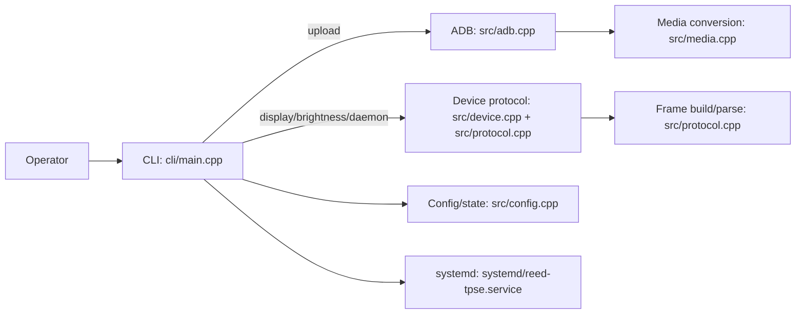

## reed-tpse Improvement / Evaluation Notes

### Date
2026-03-19

### Project
`reed-tpse` is a C++17 Linux CLI + systemd user-daemon for driving a “Tryx Panorama SE AIO cooler display” via a reverse-engineered serial protocol plus ADB file transfer.

### What I evaluated
- Architecture clarity and module boundaries
- Correctness risks in frame building/parsing and config/state handling
- Security posture (command execution, injection, protocol integrity)
- Runtime/daemon reliability (keepalive loop, reconnection/error handling)
- Test/CI gaps and what hardware-free tests would add value

---

## Architecture (high-level)

### Components
- CLI frontend: [`cli/main.cpp`](cli/main.cpp)
- Serial device + protocol:
  - Frame build/parse: [`src/protocol.cpp`](src/protocol.cpp), [`include/reed/protocol.hpp`](include/reed/protocol.hpp)
  - Device I/O + commands: [`src/device.cpp`](src/device.cpp), [`include/reed/device.hpp`](include/reed/device.hpp)
- ADB wrapper + media file transfer: [`src/adb.cpp`](src/adb.cpp), [`include/reed/adb.hpp`](include/reed/adb.hpp)
- Media type detection + GIF->MP4 conversion:
  - [`src/media.cpp`](src/media.cpp), [`include/reed/media.hpp`](include/reed/media.hpp)
- Config/state:
  - JSON handling + XDG paths: [`src/config.cpp`](src/config.cpp), [`include/reed/config.hpp`](include/reed/config.hpp)
- Daemon persistence:
  - systemd user unit: [`systemd/reed-tpse.service`](systemd/reed-tpse.service)

### Data flow map

---

## Ranked findings (with evidence)

### 1) Critical — Host command injection via ADB wrapper
**Evidence:**
- [`src/adb.cpp`](src/adb.cpp)
  - `Adb::run_command()` builds a shell command string and executes it with:
    - `popen(cmd.c_str(), "r")`
  - The “shell escape” logic only quotes an argument when it contains a space or `'`.
  - It does not robustly escape/quote shell metacharacters such as `;`, `&`, `|`, `$()`, backticks, etc.

**Why this matters:**
- Inputs can flow into host command arguments through:
  - `reed-tpse upload <file>` -> `cmd_upload()` -> `Adb::push(local_path, remote_name)`
  - `reed-tpse delete <file...>` -> `cmd_delete()` -> `Adb::remove(filename)`
- If an attacker can supply crafted filenames/paths, this can execute arbitrary commands on the host.

**Impact:**
- Arbitrary host command execution (highest severity).

---

### 2) High — Protocol integrity checks are incomplete
**Evidence:**
- [`src/protocol.cpp`](src/protocol.cpp)
  - `calculate_crc()` is used in `build_frame()`.
  - In `parse_response()`:
    - CRC bytes are stripped from the payload, but no CRC validation is performed.
    - `parse_response()` does not use the frame “length” field to enforce expected size.
- [`src/device.cpp`](src/device.cpp)
  - `Device::read_response()` breaks out when it sees `FRAME_MARKER` at both ends rather than using the declared length field or a strict state machine.

**Why this matters:**
- Corrupted frames could be accepted as valid.
- Partial/multi-frame reads could cause mis-parsing and undefined device behavior.

**Impact:**
- Incorrect device commands, fragile parsing under noisy serial conditions.

---

### 3) High — Daemon reliability: errors aren’t enforced and time inputs aren’t validated
**Evidence:**
- [`cli/main.cpp`](cli/main.cpp)
  - Daemon loop:
    - keepalive loop calls `device.handshake()` but doesn’t handle failure/reconnect attempts.
  - Restore on daemon start:
    - `device.handshake();`, then `device.set_screen_config(screen_config);`, then `device.set_brightness(state->brightness);`
    - Call results are not checked; failures can silently leave device state inconsistent.
  - `keepalive_interval` is read from config without bounds checking.

**Impact:**
- Reduced robustness in real-world conditions; potential for tight loops or prolonged failure-to-recover.

---

### 4) Medium — GIF handling mismatch in `display`
**Evidence:**
- [`cli/main.cpp`](cli/main.cpp)
  - `cmd_display()` rewrites GIF filenames to their converted `.mp4` names via `Media::get_converted_name(f)`, but it does not call GIF conversion there.
  - If the `.mp4` was not uploaded previously, the device may not have the expected file.

**Impact:**
- Display command may fail or display incorrect/stale media.

---

### 5) Medium — Fragile ADB success/failure detection
**Evidence:**
- [`src/adb.cpp`](src/adb.cpp)
  - `Adb::push()` determines success by substring matching (`"pushed"`, `"1 file"`).
  - `Adb::remove()` determines behavior by substring matching.

**Impact:**
- Non-English adb output, version differences, or unexpected stderr/stdout formatting can cause false positives/negatives.

---

### 6) Low — No automated tests/CI configured
**Evidence:**
- [`CMakeLists.txt`](CMakeLists.txt)
  - No `enable_testing()`, no `add_test()`, no `ctest`.
- Repo scan found no CI workflow configs (e.g. no `.github/workflows/*`).

**Impact:**
- Protocol parsing and frame building regressions are likely to go undetected.

---

## Build status / verification performed
- CMake Release build succeeded for the project.
- Compilation emitted warnings originating from the bundled `include/reed/picojson.h` (template/uninitialized warnings from that header), not from project logic.

---

## Recommended improvements (actionable)

### A) Close the injection hole (highest priority)
Target: [`src/adb.cpp`](src/adb.cpp)
1. Replace shell-string execution with argv-based execution:
   - Use `execvp`/`posix_spawn`/`fork+exec` or an equivalent mechanism that passes arguments directly to `adb`.
2. Remove ad-hoc quoting logic.
3. Additionally validate remote names:
   - For remote filenames, restrict to basename-only (`std::filesystem::path(local).filename()`), reject path separators and control characters.

### B) Harden protocol parsing
Target: [`src/protocol.cpp`](src/protocol.cpp), [`src/device.cpp`](src/device.cpp)
1. Validate CRC in `parse_response()`:
   - Compute CRC over the same byte region used in `build_frame()`, compare with CRC byte.
2. Enforce length/declared frame boundary:
   - Either:
     - Use the length field to know how many bytes to read before attempting parse, or
     - Implement a streaming parser that accumulates until a full frame is complete.
3. Add minimum sanity checks before parsing JSON:
   - Ensure the content-length/header/body separation is consistent.

### C) Improve daemon safety and recoverability
Target: [`cli/main.cpp`](cli/main.cpp), [`systemd/reed-tpse.service`](systemd/reed-tpse.service)
1. Validate `keepalive_interval` bounds after config load.
2. Check return values for:
   - `device.handshake()`
   - `device.set_screen_config(...)`
   - `device.set_brightness(...)`
3. On handshake failure:
   - Attempt reconnect with backoff (or at least retry handshake before proceeding).

### D) Make `display` robust for GIF inputs
Target: [`cli/main.cpp`](cli/main.cpp), [`src/media.cpp`](src/media.cpp)
1. If a GIF is detected during `display`, either:
   - Convert it on-the-fly (and upload if needed), or
   - Fail fast with a clear error message: “GIF must be uploaded/converted first”.

### E) Make ADB result handling deterministic
Target: [`src/adb.cpp`](src/adb.cpp)
1. Prefer adb exit status and/or more precise output parsing.
2. Consider `adb` options that make output stable (where possible).

### F) Add hardware-free tests + CI
Targets: `CMakeLists.txt` and new `tests/` (planned)
1. Add `enable_testing()` + `ctest`.
2. Add unit tests for:
   - `escape_data()`/`unescape_data()` roundtrip
   - `build_frame()` output invariants (marker presence, header format, length field consistency)
   - JSON config/state load/save with temporary XDG directories
   - Media type detection (`detect_type()`)
3. Add CI workflow (GitHub Actions or similar) that runs:
   - `cmake -S . -B build && cmake --build build`
   - `ctest --output-on-failure`

---

## Test/CI gap plan (suggested)
- Phase 1 (immediate, no hardware)
  - Protocol escape/unescape, frame building invariants, config/state serialization, media type detection.
- Phase 2 (optional, still no device required)
  - Protocol parse tests using synthetic frames generated by `build_frame()` (and/or captured golden frames).
- Phase 3 (integration, optional)
  - A fake serial transport layer around `Device::read_response()` for deterministic tests.

---

## Residual risks to keep in mind
- The serial protocol is reverse-engineered; correctness and edge-case robustness depend heavily on parsing integrity.
- The lack of tests increases the risk of accidental regressions in framing/parsing logic.
- Media conversion and ADB operations remain external command execution paths and should be treated as such (fail with clear messages and validate outputs).

