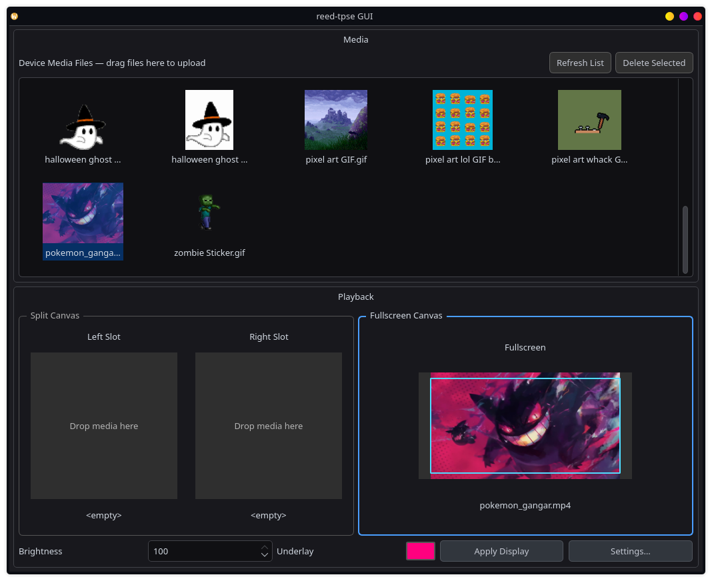
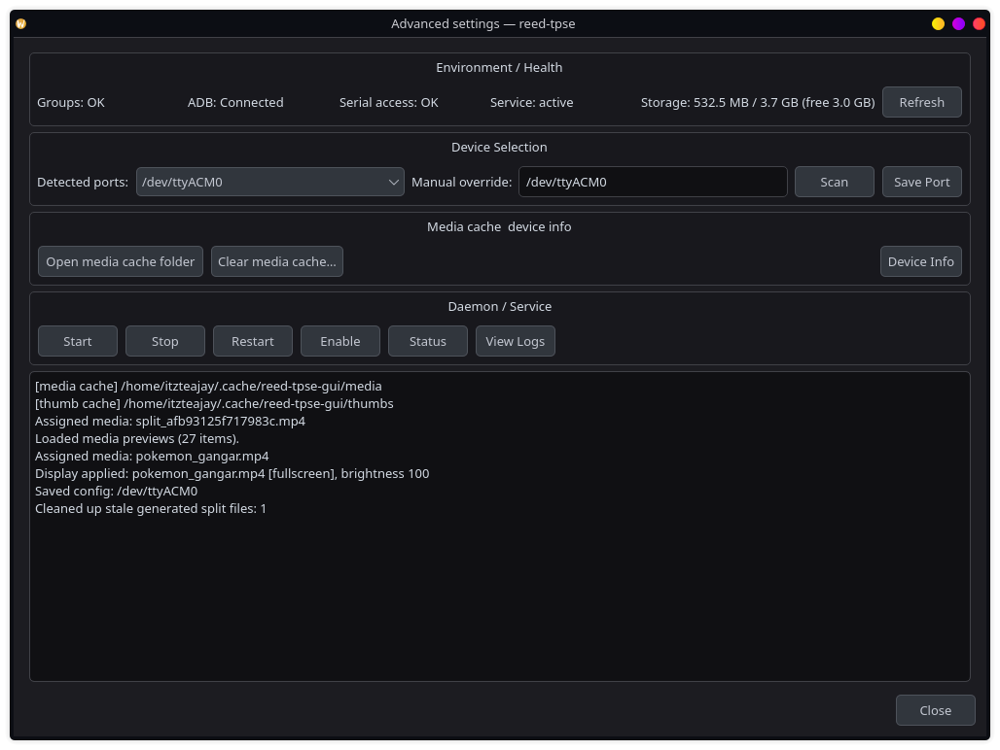

# reed-tpse

Linux CLI for Tryx Panorama SE AIO cooler display, reverse-engineered protocol, not affiliated with Tryx.

https://github.com/user-attachments/assets/1bc87fa9-cde9-4fd5-ab35-a1a15152c467

## GUI





## Currently supported features

- CLI + Qt6 GUI frontends backed by the same core library
- Upload images, videos, and GIFs to device media storage
- Split canvas mode (2 slots) and fullscreen canvas mode
- Interactive crop/position controls for composed output
- Underlay color composition for GIF/image alpha workflows
- Set display content and brightness
- List and delete media files on device
- systemd user service for persistent display across reboots
- Auto-detect device ports (`/dev/ttyACM*`) with manual override
- On-device media preview grid with local cache + thumbnail cache

## TODO

- [ ] CPU stats overlay (temperature, usage, clock speed)
- [ ] GPU stats (temperature, usage, VRAM, clock speed)
- [ ] RAM usage
- [ ] Fan/pump RPM display
- [ ] Network throughput
- [ ] Custom overlay layouts

I believe the stats features bove (like CPU stats) should not be too difficult, but I think the image generation (given stats, how do we generate images dynamically with stats rendered on them?) part will be quite challenging. Hopefully the team at Tryx release a Linux Kanali build before we have to implement these features lol.

## Requirements

**Build:**
- CMake >= 3.16
- C++17 compiler (GCC 8+ / Clang 7+)
- Qt6 Widgets (optional, only required for `reed-tpse-gui`)

**Runtime:**
- `adb` - for file transfer (android-tools on Arch, adb on Debian/Ubuntu)
- `ffmpeg` - used by GUI composition/thumbnail generation and GIF/image compose paths
- `ffprobe` - used by GUI to probe media duration/dimensions before composition

**Permissions:**
- User must be in `uucp` group (Arch) or `dialout` (Debian/Ubuntu) for serial access
- Or run with sudo

## Build

```bash
cd reed-tpse
mkdir build && cd build
cmake ..
make
sudo make install
```

If Qt6 is installed, CMake also builds and installs:

```bash
reed-tpse-gui
```

## Usage

```bash
# Upload media to device
reed-tpse upload video.mp4
reed-tpse upload animation.gif  # Auto-converts to MP4

# Set display and start daemon (recommended)
reed-tpse display video.mp4 --brightness 80
reed-tpse daemon start

# That's it. Display persists across reboots.
```

### All commands

```bash
reed-tpse info                   # Show device info
reed-tpse upload <file>          # Upload media file
reed-tpse display <file>         # Set display content
reed-tpse brightness <0-100>     # Adjust brightness
reed-tpse list                   # List files on device
reed-tpse delete <file>          # Delete file from device
reed-tpse daemon start           # Start background keepalive
reed-tpse daemon stop            # Stop daemon
reed-tpse daemon status          # Check daemon status
```

### GUI

```bash
reed-tpse-gui
```

The GUI covers CLI operations and adds:
- **Split Canvas** (Left + Right slots): drag media from the device grid into each slot, then apply as one composed output
- **Fullscreen Canvas** (single slot): drag one media item and apply directly
- **Interactive crop preview** per slot: drag to reposition crop area, mouse wheel to zoom crop
- **Underlay color swatch**: choose compose background color used for alpha/GIF/image paths
- **Apply Display** sends selected/composed media + brightness
- Drag files from your file manager onto **Device Media Files** to upload (ADB)
- Device media preview grid with thumbnails (cached locally), multi-select delete, refresh
- **Settings…** dialog with:
  - Environment/health checks (groups, ADB, serial access, service state, storage)
  - Device selection (`/dev/ttyACM*`) + manual port override + save
  - Media cache utilities (open/clear)
  - Device Info (USB handshake metadata)
  - systemd user service controls (start/stop/restart/enable/status + journal logs)
  - Operation log pane
- GUI compose output targets **2240×1080 @ 60Hz** and writes stream tags for **2:1 DAR + SAR 27/28** to align with firmware `ratio` handling and reduce letterboxing.

## Configuration

Config: `~/.config/reed-tpse/config.json`

```json
{"brightness":100,"keepalive_interval":10}
```

Port is auto-detected by default. To pin a specific port:
```json
{"port":"/dev/ttyACM1","brightness":100,"keepalive_interval":10}
```

Display state (for daemon): `~/.local/state/reed-tpse/display.json`

## Architecture

```
reed-tpse/
├── include/reed/      # Public headers (libreed)
│   ├── picojson.h     # JSON parser (header-only, third-party)
│   ├── protocol.hpp   # Frame protocol
│   ├── device.hpp     # Serial device communication
│   ├── adb.hpp        # ADB wrapper
│   ├── media.hpp      # Media type detection, GIF conversion
│   └── config.hpp     # XDG config/state management
├── src/               # Library implementation
├── cli/               # CLI frontend
└── systemd/           # systemd user service
```

The core functionality is in `libreed.a`. Both the CLI (`reed-tpse`) and GUI (`reed-tpse-gui`) link against the same library.

## How it works

This is a TLDR on how it works. I plan to write a blog post on this some time in the future. Will update this section once the blog post is live.

The Tryx Panorama SE exposes:
1. **USB CDC ACM** (`/dev/ttyACM0`): Serial interface for display commands
2. **ADB**: Android Debug Bridge for file transfer to `/sdcard/pcMedia/`

The device requires periodic keepalive (~60s timeout) or it reverts to the default screen. The daemon runs in the background (~1MB RAM, negligible CPU, I bet you could run this on a potato and not notice it) and handles this automatically.

## Device reference

Detailed hardware and ADB capability profile for the currently characterized device:
- [`DEVICE_REFERENCE.md`](DEVICE_REFERENCE.md)

## Tested on

| Distro | Kernel | CPU | GPU | Contributor |
|--------|--------|-----|-----|-------------|
| Arch Linux | 6.17.9 | Intel Core Ultra 9 285K | NVIDIA RTX 5080 | [@fadli0029](https://github.com/fadli0029) |
| Bazzite | 6.17.7 | AMD Ryzen 7 9800X3D | Radeon RX 9070XT | [@CRE82DV8](https://github.com/CRE82DV8) |

If you've tested on a different system, feel free to add yours via PR.

## License

MIT

## Contributing

Issues and pull requests welcome at https://github.com/fadli0029/reed-tpse
